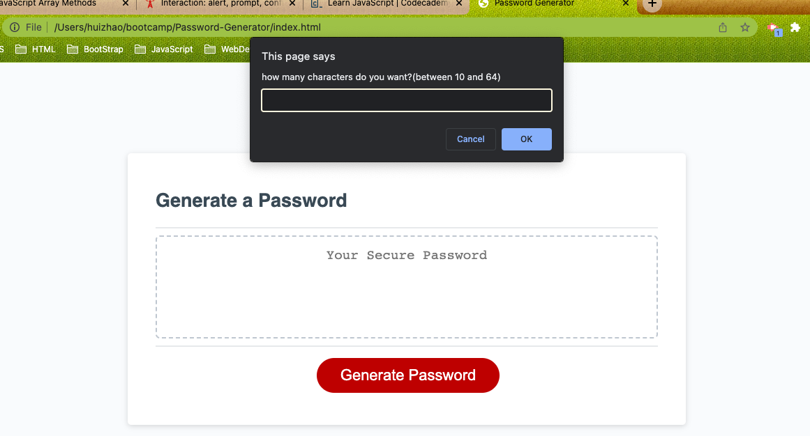
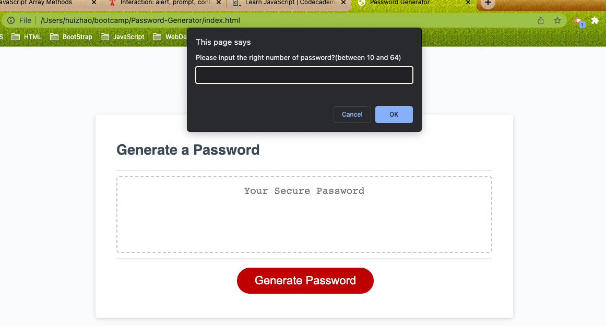
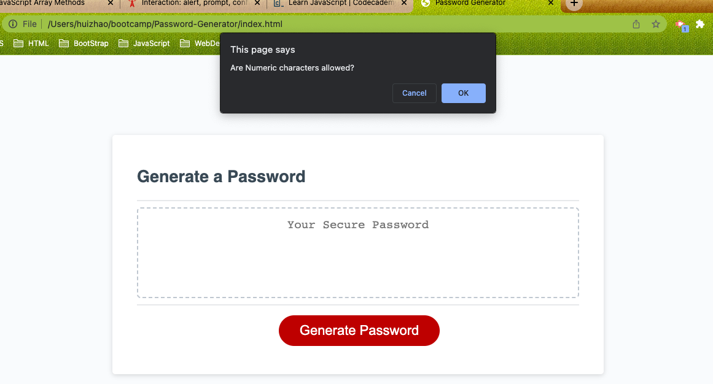
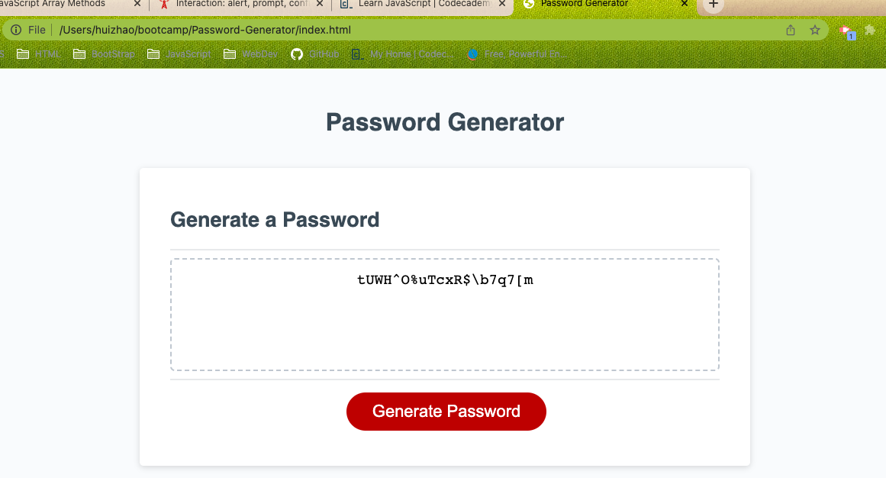

# Password-Generator
## It's a code that an employee can use to generate a random password.  it has a buton when an employee click it, a password will be generated.

## There are a series of prompts for password criteria

* Length of password
  * At least 10 characters but no more than 64.

* Character types
  * Lowercase
  * Uppercase
  * Numeric
  * Special characters ($@%&*, etc)
  
* At least one character type should be selected,if not display in an alert let user know
* Once prompts are answered then the password should be generated
 
## There are some screenshots

## This is the link
*  https://joy-hui.github.io/Console-Finances/

